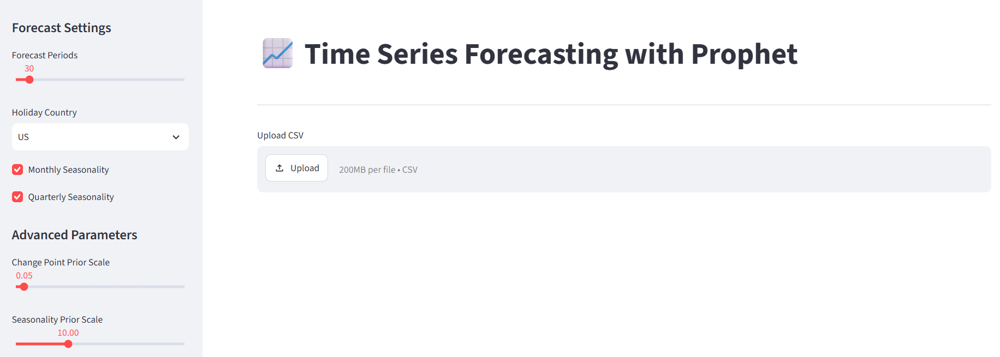
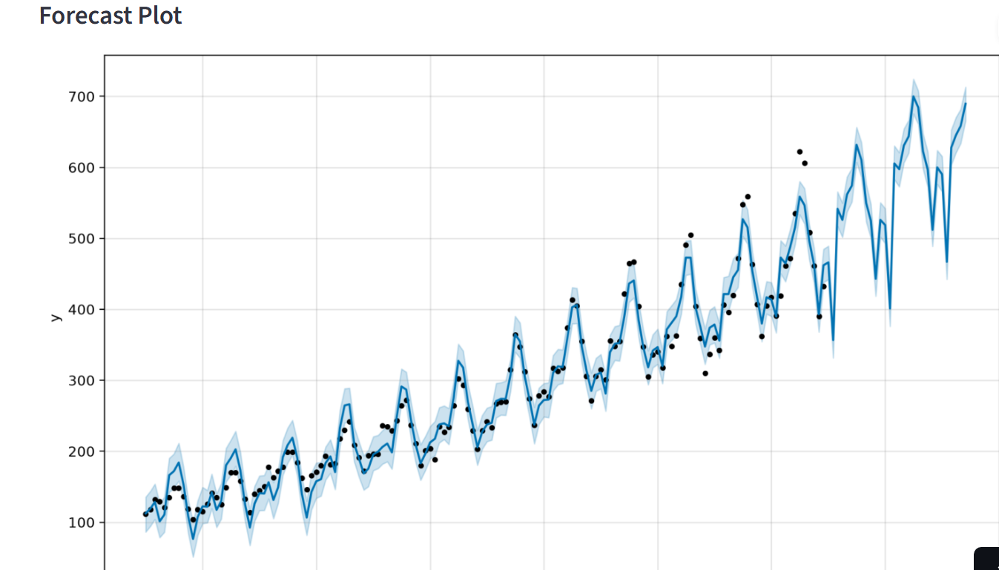

https://airpassenger-forecasting-ubroxvsgsbjvkw3pnz2yka.streamlit.app/

# 📈 Air Passenger Forecasting using Prophet


A time series forecasting app built with [Facebook Prophet](https://facebook.github.io/prophet/) and [Streamlit](https://streamlit.io/). Upload any CSV with a date column and a numeric target column to train a forecasting model, visualize predictions, and download results.

---

## Features

✔ Upload CSV
✔ Automatic Missing Value Handling
✔ Automatic Frequency Detection
✔ Holiday Effects
✔ Custom Seasonality
✔ Confidence Intervals
✔ RMSE, MAE, MAPE
✔ Interactive Charts
✔ Download Forecast

---

## Installation

Clone the repository:

```bash
git clone https://github.com/anil11887/AirPassenger-Forecasting.git
cd AirPassenger-Forecasting
```

Create and activate a virtual environment:

```bash
python -m venv .venv

# Windows
.venv\Scripts\activate

# macOS/Linux
source .venv/bin/activate
```

Install dependencies:

```bash
pip install -r requirements.txt
```

---

## Run

```bash
streamlit run app.py
```

The app will open automatically in your browser at `http://localhost:8501`.

---

## Screenshots

### Home Screen



### Forecast



---

## Future Improvements

- [ ] Support for multiple target columns / multivariate forecasting
- [ ] Support for additional forecasting models (ARIMA, LSTM) for comparison
- [ ] Deploy with authentication for private datasets
- [ ] Automated report export (PDF/Word) of forecast results

---

## Built With

- [Prophet](https://facebook.github.io/prophet/) — time series forecasting library by Meta
- [Streamlit](https://streamlit.io/) — web app framework for data apps
- [Pandas](https://pandas.pydata.org/) — data manipulation
- [Matplotlib](https://matplotlib.org/) — plotting

---

## License

This project is licensed under the MIT License.
